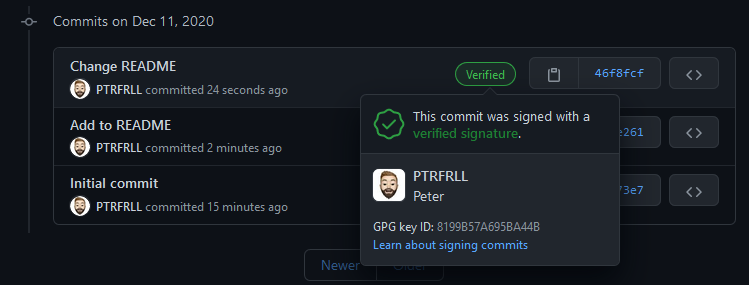

# PGP Test

Did you know you can sign git commits?!

Check it out in the [commit log](https://github.com/PTRFRLL/pgp/commits/main)

[Here's how you can too](https://docs.github.com/en/free-pro-team@latest/github/authenticating-to-github/generating-a-new-gpg-key)